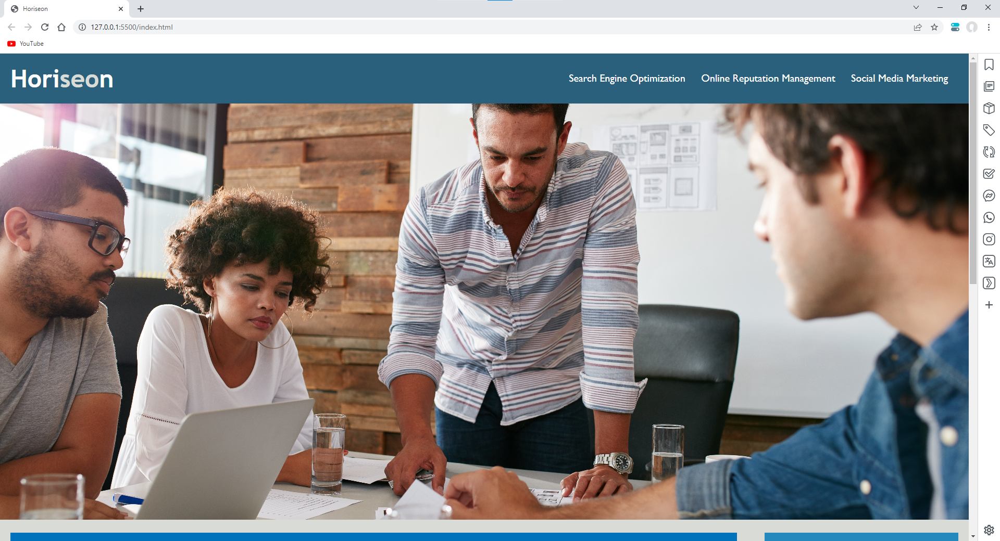

# WeekOneChallenge_refactorAccessibility

## Description
My motivation for refactoring this project was to learn more about HTML and CSS, and how they interact. I refactor this project to learn how I could make changes to code to make it more accessibile to others. The refactoring of the code solves the problem of makeing the website more accessibile to wider range of people. I learned how to use semantic tags and how they influence the CSS of a website from this project.

## Link
This is a link to webpage:(https://foundeven.github.io/WeekOneChallenge_refactorAccessibility/)

Most of the code from this project was not made by me. It was made by UTSA and was used to help me learn about semantic tags.
